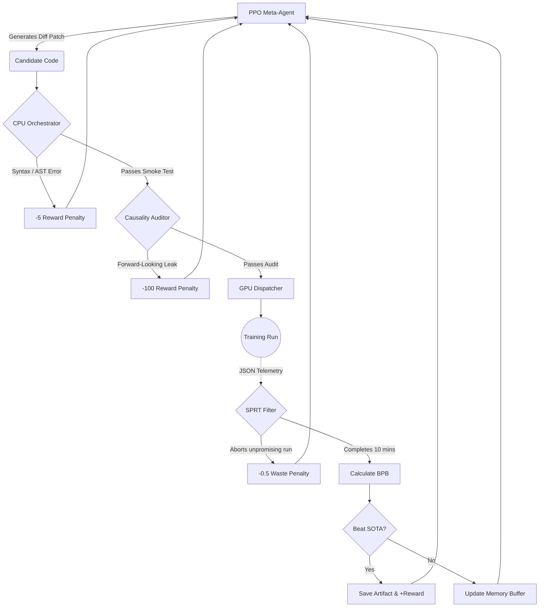
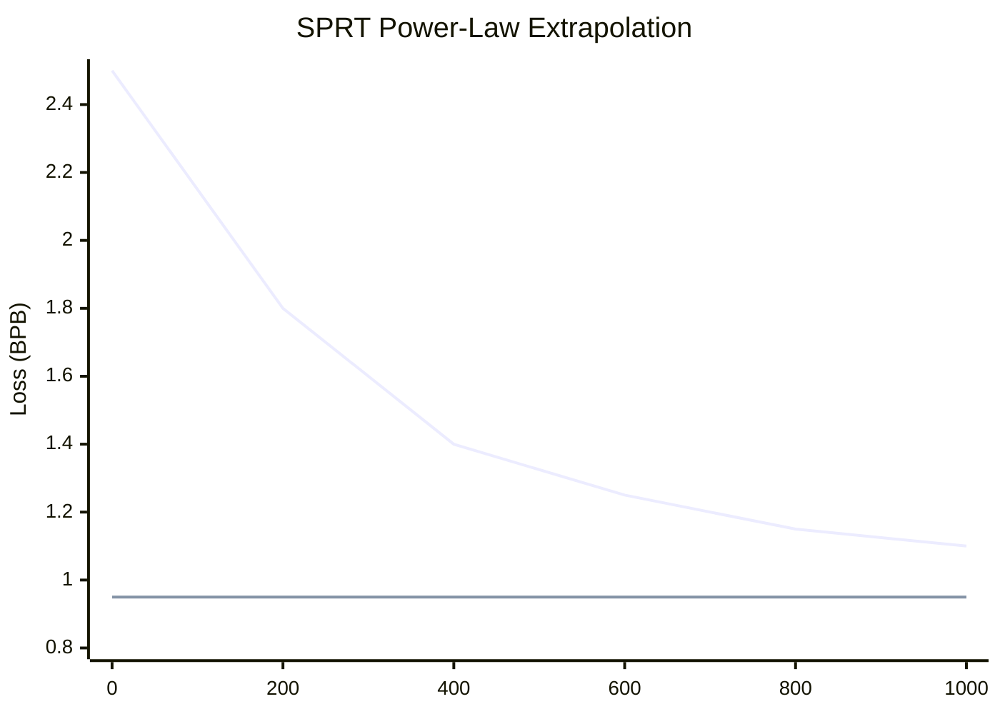
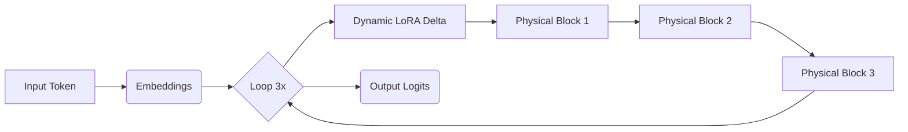

# 🧬 AutoResearch-RL: The Perpetual Code Mutator

<div align="center">
  
  
  
</div>

<br>

**AutoResearch-RL** is a fully autonomous, perpetual agentic framework based on Proximal Policy Optimization (PPO). Its singular, relentless objective is to optimize the architecture and hyperparameters of a transformer model to beat the **OpenAI Parameter Golf** challenge.

By modeling the deep learning research process as a discrete Markov Decision Process (MDP), AutoResearch-RL continuously mutates a target `train_gpt.py` script. It orchestrates thousands of asynchronous experiments, evaluates them under draconian constraints, and learns from its own historical trajectory to push the boundaries of data compression (Bits-Per-Byte).

---

## 🚀 The Challenge: Draconian Constraints

The system operates under immutable "physical laws" enforced during every evaluation cycle. Any violation results in an immediate run abort and a negative reward penalty for the agent.

*   **💾 16MB Capacity Limit (Artifact Size):** The *entire* resulting payload (source code + compressed model weights) must fit within strictly 16,000,000 bytes. This necessitates extreme strategies like Int6 quantization and zstd-22 compression.
*   **⏱️ 10-Minute Wall-Clock Limit:** Training and evaluation on a cluster of 8xH100 SXM GPUs with NVLink must conclude in exactly 10 minutes.
*   **🛡️ Absolute Causality:** Strict prohibition of forward-looking data leakage on the validation set. Only backward-looking Test-Time Training (TTT) is permitted.
*   **📦 Zero-Dependency Isolation:** The generated `train_gpt.py` must be entirely self-contained. Downloading external data, models, or dependencies during runtime is strictly banned.

---
# 🚀 Key Innovation

AutoResearch‑RL transforms parameter search into an **autonomous research loop**. Instead of pre‑defined
hyper‑parameter grids, it lets a transformer‑based RL agent directly **edit the training script** and observe
the outcome. This open‑ended code‑editing strategy unlocks a much larger search space than conventional
NAS or AutoML.

```
Diff‑based RL actions: The agent proposes JSON diff patches to the train.py file, enabling
changes to architecture, optimizer, scheduler or even evaluation logic.
Self‑evaluating loop: Each experiment runs under a fixed wall‑clock budget and reports val‑bpb. A
power‑law early‑stopping module aborts ~54 % of bad runs , dramatically boosting throughput.
Transformer policy with PPO: A LoRA‑fine‑tuned LLM uses PPO to learn which edits improve
val‑bpb, ensuring continual improvement over thousands of iterations.
```
# ✅ Benefits

```
Broader discovery: Because actions operate on code, the agent can uncover counter‑intuitive
strategies (e.g., constant LR outperforming cosine schedules for RL fine‑tuning ) that static
search spaces would miss.
Resource awareness: The seed model incorporates depth‑recurrent loops, int6 quantization and
selective precision , aligning with Parameter Golf constraints.
Efficient experimentation: Real‑time early stopping and novelty bonuses focus compute on
promising ideas, allowing the system to run hundreds of experiments overnight.
```
# 🌍 Implications

AutoResearch‑RL hints at a future where **autonomous agents drive scientific discovery**. By reframing
model search as an RL problem and giving the agent control over source code, it provides a template for
exploring **architecture, optimisation and tokenisation** simultaneously. Extending the action space to
tokeniser and evaluation‑time compute strategies could unlock further gains and make this approach a
competitive entrant in challenges like Parameter Golf.

---

## 🧠 Core Concepts & System Architecture

AutoResearch-RL abandons traditional static Neural Architecture Search (NAS) in favor of a dynamic, self-correcting loop. The system is split into an asymmetrical architecture: a cheap CPU orchestrator and expensive GPU evaluation nodes.

### The Perpetual Research Loop (MDP)

The research cycle is formulated as a Markov Decision Process (MDP). The agent does not write code from scratch; it issues precise `diff` patches against the current State-of-the-Art (SOTA) code.



### 1. Power-Law SPRT Filter (Early Stopping)
To maximize GPU cluster utilization, AutoResearch-RL predicts the final loss of a model midway through its training. By fitting the telemetry stream to a power-law curve ($L(t) = a \cdot t^{-b} + c$), the SPRT (Sequential Probability Ratio Test) filter aborts runs that statistically cannot cross the SOTA threshold, saving up to 54% of compute time.


*(If the projected asymptote is far above the threshold, the run is terminated.)*

### 2. The "Golden Seed" Architecture (`train_gpt.py`)
To kickstart the agent, the system begins with a highly condensed, hyper-optimized starting point containing experimental ML techniques:

*   **Int6 Quantization:** Simulates per-row Int6 weights stored separately from FP16 scales to maximize Zstd dictionary compression.
*   **Depth Recurrence:** Instead of 9 physical layers, the model allocates 3 physical blocks and runs them in a loop 3 times. To prevent representation collapse, a dynamic LoRA (Rank=4) delta is applied per iteration.
*   **Swarm N-gram Mixer:** (Mocked) A massive hash table utilizing NVLink to mix statistical N-grams (N=2 to 10) with neural logits based on entropy.



---

## 📊 Implementation Status Report

All foundational milestones for the AutoResearch-RL framework MVP have been successfully implemented and validated.

| Component | Status | Details & Notes |
| :--- | :---: | :--- |
| **Directory Structure & APIs** | ✅ **Complete** | Defined in `architecture.md` and `api_doc.md`. Clean separation of concerns. |
| **CPU Orchestrator** | ✅ **Complete** | Implements AST syntax smoke tests and explicitly calculates precise `zstandard` capacity limits for heterogeneous parameter types. |
| **SPRT Early Stopping** | ✅ **Complete** | Uses `scipy` covariance matrices for confidence intervals and implements plateau abort detection. |
| **MDP Environment / Reward** | ✅ **Complete** | Dynamically scales novelty, penalizes late-abort compute waste, and structurally logs components. |
| **Causality Auditor** | ✅ **Complete** | Employs both recursive AST static analysis and runtime dynamic assertion instrumentation. |
| **Golden Seed (`train_gpt.py`)** | ✅ **Complete** | Consolidates a hyperparameter search space (`GPTConfig`) atop simulated Int6 layers, QK-Norm, Depth Recurrence, and the Muon Optimizer. |
| **PPO Meta-Agent** | ✅ **Operational** | Integrates directly with the OpenAI API (`gpt-4o`) via `OPENAI_API_KEY` and utilizes a robust, whitespace-insensitive `DiffParser`. |
| **GPU Dispatcher** | ✅ **Operational** | Supports an isolated Python subprocess or true `nvidia-docker` distributed execution (`use_docker=True`) via `Dockerfile.cuda`. |
| **Perpetual Loop (`main.py`)**| ✅ **Operational** | Ties all components into a 24/7 autonomous cycle that actively writes to `experiment_logs.jsonl` and saves SOTA code artifacts. |

---

## 🛠️ Operational Guide: Setup, Run, Experiment

Getting started with AutoResearch-RL is simple. The system can run locally on a CPU using subprocess simulations or scale out to a true 8xH100 CUDA Docker environment.

### 1. Prerequisites
Ensure you have Python 3.10+ installed. Install the required dependencies to run the system and its test suite:

```bash
pip install numpy scipy torch zstandard pytest openai
```

### 2. Running the Automated Test Suite
To verify the integrity of the core components (Diff Parser, Auditor, SPRT, Orchestrator), run the `pytest` suite:

```bash
pytest tests/
```

### 3. Exploring the Golden Seed
Before running the main loop, you can independently test the highly-optimized `train_gpt.py` seed script to verify its forward/backward pass, dynamic causality assertions, and Sliding Window Evaluation mechanism:

```bash
python3 seed/train_gpt.py
```

### 4. Testing the Causality Auditor
You can test the static analysis engine that prevents cheating:
```bash
python3 auditor/causality_auditor.py
```

### 5. Running the Perpetual Agent Loop
To start the continuous AutoResearch cycle, simply execute `main.py`.

```bash
python3 main.py
```

**What to expect during execution:**
1. The script will load the `train_gpt.py` Golden Seed.
2. The PPO Agent will query the LLM (or mock) and generate a code mutation targeting `GPTConfig` hyperparameters. The `DiffParser` will apply it robustly.
3. The Orchestrator will run an AST syntax check, a `zstandard` capacity check, and the Causality Auditor.
4. The `GPUDispatcher` will spawn a subprocess (or Docker container) simulating the training run.
5. The `SPRTFilter` will actively monitor the simulated loss stream. If the run is poor, it will instantly ABORT it.
6. The `AutoResearchEnv` will calculate the complex reward and update its memory buffer.
7. If a new State-of-the-Art (SOTA) is achieved, the script is saved to the `/artifacts/` directory and logged to `experiment_logs.jsonl`.

### 6. Experimenting & Hacking
*   **Activate Real LLM Mutations:** Export your OpenAI API key (`export OPENAI_API_KEY="sk-..."`) before running `main.py`. The agent will seamlessly switch from mock patches to querying `gpt-4o`.
*   **Dockerized GPU Cluster Run:** Open `main.py` and set `use_docker=True` when instantiating the `GPUDispatcher`. Ensure you have built the image via `docker build -t autoresearch-rl-node -f Dockerfile.cuda .` and have `nvidia-docker` installed.
*   **Analyze Logs:** Review the `experiment_logs.jsonl` file to parse iteration statistics, exact reward distributions, SPRT abort timings, and SOTA BPB drops over time.

---
*Built for the pursuit of sub-1.0 BPB.*
