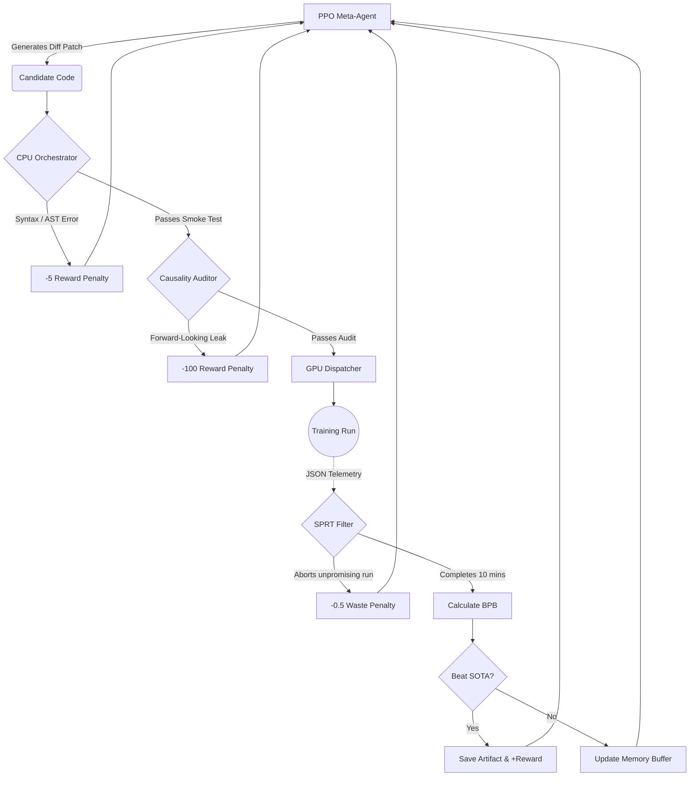
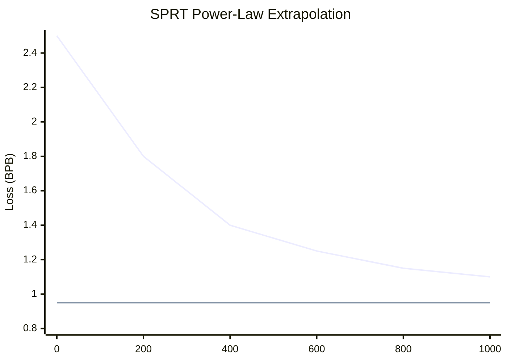
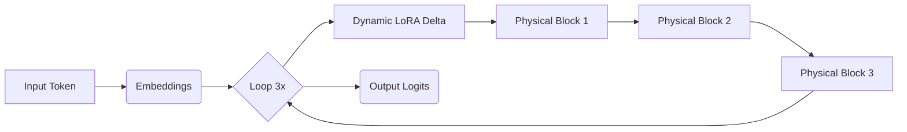

# 🧬 AutoResearch-RL: The Perpetual Code Mutator

<div align="center">
  
  
  
</div>

<br>

**AutoResearch-RL** is a fully autonomous, perpetual agentic framework based on Proximal Policy Optimization (PPO). Its singular, relentless objective is to optimize the architecture and hyperparameters of a transformer model to beat the **OpenAI Parameter Golf** challenge.

By modeling the deep learning research process as a discrete Markov Decision Process (MDP), AutoResearch-RL continuously mutates a target `train_gpt.py` script. It orchestrates thousands of asynchronous experiments, evaluates them under draconian constraints, and learns from its own historical trajectory to push the boundaries of data compression (Bits-Per-Byte).

---

## 🚀 The Challenge: Draconian Constraints

The system operates under immutable "physical laws" enforced during every evaluation cycle. Any violation results in an immediate run abort and a negative reward penalty for the agent.

*   **💾 16MB Capacity Limit (Artifact Size):** The *entire* resulting payload (source code + compressed model weights) must fit within strictly 16,000,000 bytes. This necessitates extreme strategies like Int6 quantization and zstd-22 compression.
*   **⏱️ 10-Minute Wall-Clock Limit:** Training and evaluation on a cluster of 8xH100 SXM GPUs with NVLink must conclude in exactly 10 minutes.
*   **🛡️ Absolute Causality:** Strict prohibition of forward-looking data leakage on the validation set. Only backward-looking Test-Time Training (TTT) is permitted.
*   **📦 Zero-Dependency Isolation:** The generated `train_gpt.py` must be entirely self-contained. Downloading external data, models, or dependencies during runtime is strictly banned.

---

## 🧠 Core Concepts & System Architecture

AutoResearch-RL abandons traditional static Neural Architecture Search (NAS) in favor of a dynamic, self-correcting loop. The system is split into an asymmetrical architecture: a cheap CPU orchestrator and expensive GPU evaluation nodes.

### The Perpetual Research Loop (MDP)

The research cycle is formulated as a Markov Decision Process (MDP). The agent does not write code from scratch; it issues precise `diff` patches against the current State-of-the-Art (SOTA) code.



### 1. Power-Law SPRT Filter (Early Stopping)
To maximize GPU cluster utilization, AutoResearch-RL predicts the final loss of a model midway through its training. By fitting the telemetry stream to a power-law curve ($L(t) = a \cdot t^{-b} + c$), the SPRT (Sequential Probability Ratio Test) filter aborts runs that statistically cannot cross the SOTA threshold, saving up to 54% of compute time.


*(If the projected asymptote is far above the threshold, the run is terminated.)*

### 2. The "Golden Seed" Architecture (`train_gpt.py`)
To kickstart the agent, the system begins with a highly condensed, hyper-optimized starting point containing experimental ML techniques:

*   **Int6 Quantization:** Simulates per-row Int6 weights stored separately from FP16 scales to maximize Zstd dictionary compression.
*   **Depth Recurrence:** Instead of 9 physical layers, the model allocates 3 physical blocks and runs them in a loop 3 times. To prevent representation collapse, a dynamic LoRA (Rank=4) delta is applied per iteration.
*   **Swarm N-gram Mixer:** (Mocked) A massive hash table utilizing NVLink to mix statistical N-grams (N=2 to 10) with neural logits based on entropy.



---

## 📊 Implementation Status Report

All foundational milestones for the AutoResearch-RL framework MVP have been successfully implemented and validated.

| Component | Status | Details & Notes |
| :--- | :---: | :--- |
| **Directory Structure & APIs** | ✅ **Complete** | Defined in `architecture.md` and `api_doc.md`. Clean separation of concerns. |
| **CPU Orchestrator** | ✅ **Complete** | Implements AST syntax smoke tests and accurately simulates 16MB size limits using `zstandard`. |
| **SPRT Early Stopping** | ✅ **Complete** | Implemented using `scipy.optimize.curve_fit`. Successfully extrapolates power-law loss bounds. |
| **MDP Environment / Reward** | ✅ **Complete** | Reward function precisely implemented (`mdp_env.py`). Maintains the history buffer of 32 experiments and calculates novelty. |
| **Causality Auditor** | ✅ **Complete** | Uses Python `ast.NodeVisitor` to statically detect forward-looking index slicing and illegal shifting operations. |
| **Golden Seed (`train_gpt.py`)** | ✅ **Complete** | Fully functional PyTorch baseline featuring simulated Int6 layers, QK-Norm, Depth Recurrence, Muon Optimizer, SWA, and Sliding Window Eval. |
| **PPO Meta-Agent** | ✅ **Complete** | Ingests the massive MDP state and uses a `DiffParser` to safely apply JSON search-and-replace patches. |
| **GPU Dispatcher** | ✅ **Complete** | Isolates training scripts in subprocesses, monitors JSON streaming telemetry, and executes SPRT aborts. |
| **Perpetual Loop (`main.py`)**| ✅ **Complete** | Ties all components together into an autonomous 24/7 research cycle that tracks SOTA BPB and saves artifacts. |

---

## 🛠️ Operational Guide: Setup, Run, Experiment

Getting started with the AutoResearch-RL MVP is simple. The current iteration uses simulated LLM responses and subprocess-based GPU execution, meaning it can be run on a standard laptop without requiring an 8xH100 cluster.

### 1. Prerequisites
Ensure you have Python 3.10+ installed. Install the required dependencies:

```bash
pip install numpy scipy torch
```
*(Optional but recommended for accurate size simulations)*: `pip install zstandard`

### 2. Exploring the Golden Seed
Before running the main loop, you can independently test the highly-optimized `train_gpt.py` seed script to verify its forward/backward pass and Sliding Window Evaluation mechanism:

```bash
python3 seed/train_gpt.py
```

### 3. Testing the Causality Auditor
You can test the static analysis engine that prevents cheating:
```bash
python3 auditor/causality_auditor.py
```

### 4. Running the Perpetual Agent Loop
To start the continuous AutoResearch cycle, simply execute `main.py`.

```bash
python3 main.py
```

**What to expect during execution:**
1. The script will load the `train_gpt.py` Golden Seed.
2. The PPO Agent will mock an LLM call and generate a code mutation (e.g., expanding the MLP layer).
3. The Orchestrator will run an AST syntax check, a capacity check, and the Causality Auditor.
4. The `GPUDispatcher` will spawn a background process simulating the training run.
5. The `SPRTFilter` will actively monitor the simulated loss stream. If the run is poor, it will instantly ABORT it.
6. The `AutoResearchEnv` will calculate the complex reward and update its memory buffer.
7. If a new State-of-the-Art (SOTA) is achieved, the script is saved to the `/artifacts/` directory.

### 5. Experimenting & Hacking
*   **Plug in a Real LLM:** Open `agent/ppo_agent.py` and replace the `mock_llm_response` string inside `generate_action()` with an actual API call to OpenAI (gpt-4o) or Anthropic (Claude 3.5 Sonnet).
*   **Adjust Constraints:** Open `orchestrator/orchestrator.py` and modify `MAX_ARTIFACT_SIZE_BYTES` or `MAX_TIME_SECONDS` to simulate different competition environments.
*   **Tweak SPRT Aggressiveness:** In `gpu_cluster/sprt.py`, modify the `margin` or `confidence_level` to see how early stopping impacts the exploration rate of the agent.

---
*Built for the pursuit of sub-1.0 BPB.*
